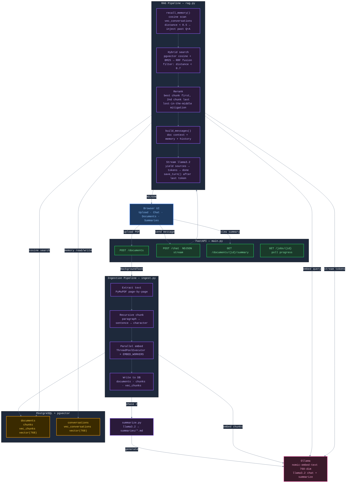

# Building a Self-Hosted RAG Assistant — Architecture Deep Dive

> A NotebookLM-style document chat built entirely on local infrastructure: FastAPI, PostgreSQL + pgvector, and Ollama. No external API keys. No cloud calls.

---

## The Core Idea

Upload a PDF. Ask questions about it. Get answers grounded in the exact paragraphs that answer your question — with citations, not hallucinations.

The system is built around three pillars:

1. **Retrieval** — find the most relevant passages from your documents before the LLM ever sees the question
2. **Augmentation** — inject those passages directly into the LLM's context so it answers from evidence, not training data
3. **Generation** — stream the answer back token by token, just like ChatGPT

This pattern is called **RAG — Retrieval-Augmented Generation**. The architecture below shows how every piece connects.

---

## System Architecture



---

## Path 1 — Uploading a Document

When you drop a PDF in the sidebar, here is exactly what happens:

### Step 1: Receive and Save

```
POST /documents  (multipart/form-data)
→ validate: .pdf extension only
→ save to uploads/{filename}
→ create job_id in memory
→ start BackgroundTask: _run_ingest()
→ return { job_id, status: "processing" }
```

The browser immediately starts polling `GET /jobs/{job_id}` every second to show live progress.

### Step 2: Extract Text

`PyMuPDF` opens the PDF and joins page text with double newlines:

```python
text = "\n\n".join(page.get_text() for page in doc)
```

If the result is under 500 characters, the system logs a warning — the PDF is likely image-based (scanned) and OCR is needed.

### Step 3: Recursive Chunking

This is the most important step for retrieval quality. Fixed-size character splitting creates chunks that cut mid-sentence, harming embedding quality. The paragraph-first recursive approach preserves semantic units:

```
1. Split on blank lines → paragraph segments
2. If a paragraph > CHUNK_SIZE (800 chars):
       split on .!? sentence boundaries
3. If a sentence > CHUNK_SIZE:
       hard character split with CHUNK_OVERLAP (150 chars) carry-over
```

Each chunk is at most 800 characters and ends on a sentence boundary wherever possible. Adjacent chunks share 150 characters of overlap so a concept split across a boundary still appears in both.

### Step 4: Parallel Embedding

Each chunk is converted to a 768-dimensional vector by `nomic-embed-text` running inside Ollama. Embedding is CPU/GPU-bound, so a `ThreadPoolExecutor` runs `EMBED_WORKERS` (default: 3) parallel calls:

```python
with ThreadPoolExecutor(max_workers=EMBED_WORKERS) as pool:
    future_to_idx = {pool.submit(get_embedding, chunk): i
                     for i, chunk in enumerate(chunks)}
```

The first chunk is slow (model cold-start, up to 90 seconds). Subsequent chunks are fast.

### Step 5: Store in PostgreSQL

Three tables are written in a single transaction:

| Table | What gets stored |
|---|---|
| `documents` | filename, filepath, page count, timestamp |
| `chunks` | raw chunk text + position index |
| `vec_chunks` | 768-dim vector via pgvector `Vector()` type |

### Step 6: Generate Summary (Phase 2)

After all chunks are written, `summarize.py` sends the full document text to `llama3.2` and asks for a structured Markdown summary with sections: Overview, Key Topics, Main Findings, Methodology, Conclusions. The result is saved to `summaries/summary_{name}_{date}.md` and is accessible via the Summary button.

---

## Path 2 — Asking a Question

When you send a message, the pipeline runs in sequence:

### Step 1: Memory Recall

Before touching the documents, the system checks whether it has seen a similar question before in this session (or any session on this device):

```python
query_vec = get_embedding(query)
SELECT question, answer, (embedding <=> query_vec) AS distance
FROM vec_conversations
WHERE distance < 0.5
ORDER BY distance LIMIT 3
```

Any past Q+A pair with cosine distance under 0.5 is injected into the system prompt. This gives the assistant continuity — it remembers what you discussed earlier even after you refresh the page.

### Step 2: Hybrid Search (the core of RAG)

Pure vector search misses exact-term queries. Pure keyword search misses semantic ones. The system uses both and fuses the results:

**Stage A — Vector retrieval**

```python
SELECT chunk_text, filename, (embedding <=> query_vec) AS distance
FROM vec_chunks JOIN chunks ... JOIN documents ...
ORDER BY distance LIMIT (TOP_K * 4)
```

pgvector returns the 20 (4 × TOP_K=5) closest chunks by cosine distance. This is the semantic candidate pool.

**Stage B — BM25 keyword scoring**

The same 20 candidates are scored by `BM25Okapi` from `rank-bm25`. This ranks chunks that contain the exact query terms highly, even if the embedding similarity was weak.

**Stage C — Reciprocal Rank Fusion**

Both rankings are combined:

```python
for each signal (vector rank, BM25 rank):
    score[chunk_i] += 1 / (60 + rank + 1)
```

The constant 60 is the standard RRF parameter. Chunks that rank well in both signals get the highest fused score.

**Stage D — Cosine threshold filter**

Chunks with cosine distance ≥ 0.7 are dropped entirely. This prevents off-topic questions from returning vaguely related chunks and producing hallucinated answers. If no chunks pass, the chat returns a clear message: *"I couldn't find content relevant to that question."*

### Step 3: Lost-in-the-Middle Reranking

Research has shown that LLMs attend most strongly to content at the beginning and end of their context window. Content buried in the middle is often ignored. The reranker exploits this:

```
Before:  [best, 2nd, 3rd, 4th, 5th]
After:   [best, 3rd, 4th, 5th, 2nd]
          ↑                     ↑
       position 0           last position
```

The most relevant chunk gets position 0. The second most relevant gets the last position. The LLM reads both.

### Step 4: Prompt Assembly

```
System:
  You are a helpful assistant that answers from the provided context.

  Document context:
  [Source: paper.pdf]
  {chunk_text}

  ---

  [Source: paper.pdf]
  {chunk_text}

  Relevant past conversation memory:
  Q: {past question}
  A: {past answer}

History: [prior tab messages as user/assistant turns]
User: {current question}
```

### Step 5: Stream Response

Ollama's streaming API sends tokens as they are generated. FastAPI wraps this in NDJSON — one JSON object per line:

```
{"type": "sources", "data": [{filename, chunk_text}, ...]}   ← sent first
{"type": "token",   "data": "The "}                           ← one per token
{"type": "token",   "data": "occupancy "}
...
{"type": "done"}                                              ← signals end
```

The browser renders source cards from the first event, then appends tokens to the chat bubble as they arrive.

### Step 6: Save to Memory

After the last token, the Q+A pair is saved:

```python
INSERT INTO conversations (session_id, turn_id, role, content)  -- user row
INSERT INTO conversations (session_id, turn_id, role, content)  -- assistant row
INSERT INTO vec_conversations (conversation_id, embedding)       -- embed the question
```

The same `turn_id` links both rows. Future queries scan `vec_conversations` and JOIN back to get the full pair.

---

## Database Schema

```
documents         id · filename · filepath · pages · created_at
 └── chunks       id · doc_id · chunk_text · chunk_index
      └── vec_chunks   chunk_id · embedding vector(768)

conversations     id · session_id · turn_id · role · content · created_at
 └── vec_conversations   conversation_id (user rows only) · embedding vector(768)
```

All foreign keys have CASCADE DELETE — removing a document automatically removes its chunks, vectors, and frees the storage.

`session_id` comes from `crypto.randomUUID()` in the browser and is stored in `localStorage`. Memory accumulates across page refreshes on the same device. Different browsers or incognito windows start a fresh session.

---

## Retrieval Thresholds Explained

pgvector's `<=>` operator returns **cosine distance**, not cosine similarity:

| Distance | Meaning |
|---|---|
| 0.0 | Identical vectors |
| 0.3–0.5 | Highly related |
| 0.5–0.7 | Loosely related |
| > 0.7 | Probably off-topic |
| 1.0 | Orthogonal (completely unrelated) |
| 2.0 | Opposite |

Two thresholds are in use:

| Variable | Value | Purpose |
|---|---|---|
| `_SEARCH_THRESHOLD` | 0.7 | Chunk relevance gate — exclude off-topic content |
| `_MEMORY_THRESHOLD` | 0.5 | Memory recall gate — only inject closely related past context |

Every query logs: `best cosine=0.3812`. Use this value to calibrate the threshold for your document domain.

---

## Startup Safety Checks

Two checks run before the server accepts any request:

**1. Embedding dimension guard**

```python
stored = SELECT array_length(embedding, 1) FROM vec_chunks LIMIT 1
if stored["dim"] != config.EMBED_DIM:
    raise RuntimeError("Dimension mismatch ...")
```

If you swap `EMBED_MODEL` (e.g. from `nomic-embed-text` 768-dim to another model), stored vectors become incomparable to new query vectors. The server fails fast rather than returning silently wrong results.

**2. Orphaned document cleanup**

```python
DELETE FROM documents
WHERE id NOT IN (SELECT DISTINCT doc_id FROM chunks)
```

If the server crashed mid-ingest, a document row exists with no chunks. It would show in the sidebar but return nothing. This cleanup removes it on every startup.

---

## Infrastructure

```
docker compose up --build
```

| Service | Image | Role |
|---|---|---|
| `app` | Built from `Dockerfile` | FastAPI on port 8000 |
| `postgres` | `pgvector/pgvector:pg16` | Vector database |
| `ollama` | `ollama/ollama:latest` | Local LLM inference |

Named volumes (`pg_data`, `ollama_models`) persist across restarts. `uploads/`, `summaries/`, and `logs/` are bind-mounted from the project directory so files survive container rebuilds.

---

## What's Being Built Next

| Priority | Feature | Why |
|---|---|---|
| P6 | Table extraction | `fitz.find_tables()` — tables currently become garbled text |
| P7 | JWT authentication | Multi-user deployment; protect all routes |
| P8 | Per-user isolation | Each user sees only their own documents and memory |
| P9 | RQ + Redis job queue | `BackgroundTasks` loses jobs if the server restarts mid-ingest |
| Phase 1 | LlamaIndex internals | Multi-format loaders, managed vector store, ChatMemoryBuffer |
| Phase 2 | LangGraph orchestration | Parallel ingest branches, conditional retrieval routing |

---

## Key Design Decisions

**Why cosine distance instead of L2?**
L2 (Euclidean) distance is magnitude-sensitive. Embedding vectors from `nomic-embed-text` are not guaranteed to be unit-normalized, so L2 values can vary widely for the same semantic relationship. Cosine distance removes magnitude from the equation and gives a consistent 0–2 scale that is easy to reason about.

**Why BM25 over the vector candidate pool, not a separate index?**
Maintaining a global BM25 index requires invalidation every time a document is added or deleted. Running BM25 over the pgvector candidate pool (4× the desired results) is correct for small to medium corpora and sidesteps the invalidation problem entirely. The pool is always fresh.

**Why RRF instead of score normalization?**
Normalizing scores from two different distributions (cosine distance, BM25 TF-IDF) requires knowing the min/max of each distribution, which changes with every query. RRF works on rank positions only — no score normalization needed, no distribution assumptions, proven effective in the retrieval literature.

**Why paragraph-first chunking?**
Fixed character splits cut mid-word and mid-sentence. The embedding model scores a chunk by its overall semantic coherence — a sentence fragment gets a worse embedding than a complete thought. Paragraph-first chunking keeps sentences whole, which improves embedding quality and makes retrieved excerpts readable.
